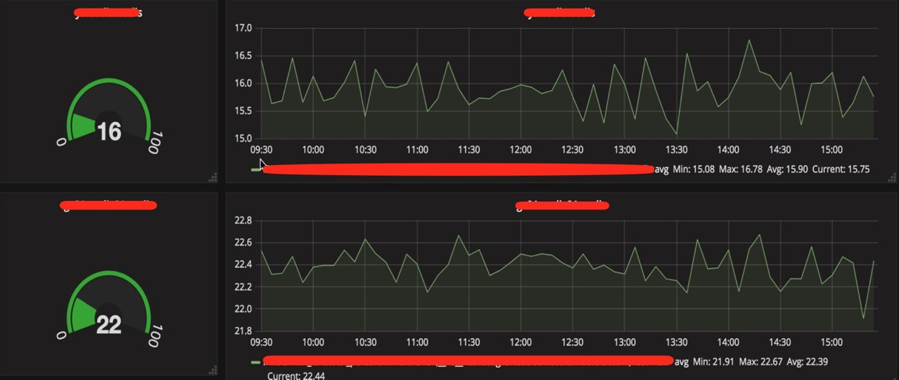
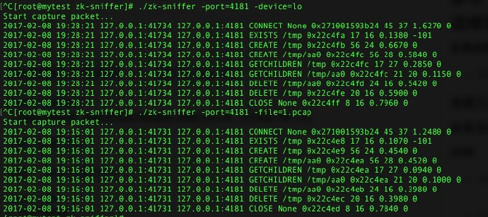
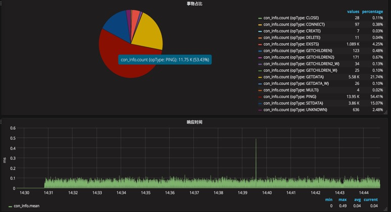

- [Zookeeper介绍](#zookeeper介绍)
	- [概述](#zookeeper概述)
	- [特点](#zookeeper特点)
	- [使用场景](#zookeeper使用场景)
	- [节点状态](#zookeeper节点状态)
	- [数据类型](#zookeeper数据类型)
	- [数据版本](#zookeeper数据版本)
	- [Watcher](#Watcher)
	- [Session](#Session)
	- [ACL](#ACL)
	- [API](#API)
	- [ZAB](#ZAB)
		- [选主流程](#选主流程)
		- [数据同步](#数据同步)
		- [过半同意](#过半同意)
- [Zookeeper运维](#zookeeper运维)
	- [部署](#部署)
		- [启动模式](#启动模式)
		- [配置文件](#配置文件)
	- [监控](#监控)
		- [端口监控](#端口监控)
		- [进程监控](#进程监控)
		- [JVM监控](#JVM监控)
		- [四字监控](#四字监控)
		- [日志监控](#日志监控)
		- [Zxid监控](#Zxid监控)
	- [日常运维](#日常运维)
		- [抓包分析](#抓包分析)
		- [分析log文件](#分析log文件)
		- [分析snapshot文件](#分析snapshot文件)
		- [zkCli.sh批量执行](#zkCli.sh批量执行)
		- [大量watch场景排查](#大量watch场景排查)
	- [一些经验](#一些经验)
		- [使用建议](#使用建议)
		- [工具推荐](#工具推荐)
		- [文章推荐](#文章推荐)
	- [一点思考](#一点思考)


# Zookeeper介绍

通过介绍Zookeeper的背景、数据类型、使用场景以及ZAB协议，让大家对Zookeeper有一个清晰的了解。

## Zookeeper概述

ZooKeeper是一个分布式的、开放源码的分布式协调服务，是Google的Chubby一个开源的实现，是Hadoop和Hbase的重要组件。它是一个为分布式应用提供一致性服务的软件，提供的功能包括：配置维护、域名服务、分布式同步、组服务等。由于Hadoop生态系统中很多项目都依赖于zookeeper，如Pig，Hive等， 似乎很像一个动物园管理员，于是取名为Zookeeper。
Zookeeper官网地址为[http://zookeeper.apache.org/](http://zookeeper.apache.org/)。


## Zookeeper特点

- <b>顺序一致性</b> 从同一个客户端发起的事务请求，将会严格按照其发起顺序被应用到zookeeper中
- <b>原子性</b> 所有事物请求的处理结果在整个集群中所有机器上的应用情况是一致的，要么整个集群中所有机器都成功应用了某一事务，要么都没有应用某一事务，不会出现集群中部分机器应用了事务，另一部分没有应用的情况。
- <b>单一视图</b> 无论客户端连接的是哪个zookeeper服务端，其获取的服务端数据模型都是一致的。
- <b>可靠性</b> 一旦服务端成功的应用了一个事务，并完成对客户端的响应，那么该事务所引起的服务端状态变更将会一直保留下来，直到有另一个事务又对其进行了改变。
- <b>实时性</b> 一旦服务端成功的应用了一个事物，那客户端立刻能看到变更后的状态


## Zookeeper使用场景

- 名字服务
- 配置管理
- 集群管理
- 集群选举
- 分布式锁
- 队列管理
- 消息订阅

## Zookeeper节点状态

- LOOKING：寻找Leader状态，处于该状态需要进入选举流程
- LEADING：领导者状态，处于该状态的节点说明是角色已经是Leader
- FOLLOWING：跟随者状态，表示Leader已经选举出来，当前节点角色是Follower
- OBSERVER：观察者状态，表明当前节点角色是Observer，Observer节点不参与投票，只负责同步Leader状态

## Zookeeper数据类型

- Zookeeper的数据结构非常类似于文件系统。是由节点组成的树形结构。不同的是文件系统是由文件夹和文件来组成的树，而Zookeeper中是由Znode来组成的树。每一个Znode里都可以存放一段数据，Znode下还可以挂载零个或多个子Znode节点，从而组成一个树形结构。
- 节点类型
  - 持久化节点(PERSISTENT)：znode节点的数据不会丢失，除非是客户端主动delete
  - 持久化顺序节点(PERSISTENT_SEQUENTIAL)：znode节点会根据当前已经存在的znode节点编号自动加 1
  - 临时节点：临时节点(EPHEMERAL)：当session中断后会被删除
  - 临时顺序节点(EPHEMERAL_SEQUENTIAL)：znode节点编号会自动加 1，当session中断后会被删除

## Zookeeper数据版本

Zookeeper的每个ZNode上都会存储数据，对应到每个ZNode，Zookeeper都会为其维护一个叫做Stat的数据结构，Stat中记录的内容如下：

- cZxid: 节点创建时的zxid
- ctime: 节点创建时间
- mZxid: 最后一次更新的zxid
- mtime: 最后一次更新的时间
- pZxid: 子节点的最后版本
- cversion: 子节点数据更新次数
- dataVersion: 节点数据更新次数
- aclVersion: acl的变更次数
- ephemeralOwner: 如果znode是临时节点，则值为所有者的sessionId；如果不是临时节点，则为零
- dataLength: 节点的数据长度
- numChildren: 子节点个数


## Watcher

Watcher(事件监听器)是 Zookeeper提供的一种 发布/订阅的机制。Zookeeper允许用户在指定节点上注册一些 Watcher，并且在一些特定事件触发的时候，Zookeeper服务端会将事件通知给订阅的客户端。该机制是 Zookeeper实现分布式协调的重要特性。

- watcher特点
	- 轻量级：一个callback函数。
	- 异步性：不会block正常的读写请求。
	- 主动推送：Watch被触发时，由 Zookeeper 服务端主动将更新推送给客户端。
	- 一次性：数据变化时，Watch 只会被触发一次。如果客户端想得到后续更新的通知，必须要在 Watch 被触发后重新注册一个 Watch。
	- 仅通知：仅通知变更类型，不附带变更后的结果。
	- 顺序性：如果多个更新触发了多个 Watch ，那 Watch 被触发的顺序与更新顺序一致
- watcher使用注意事项。
	- 由于watcher是一次性的，所以需要自己去实现永久watch
	- 如果被watch的节点频繁更新，会出现“丢数据”的情况
	- watcher数量过多会导致性能下降


## Session

zookeeper会为每个客户端分配一个session，类似于web服务器一样，用来标识客户端的身份。

- Session作用
	-  客户端标识
	-  超时检查
	-  请求的顺序执行
	-  维护临时节点的生命周期
	-  watcher通知
- Session状态
	- CONNECTING
	- CONNECTED
	- RECONNECTING
	- RECONNECTED
	- CLOSED
- Session属性
	-  sessionID：会话ID，全局唯一
	-  TimeOut：会话超时时间
	-  TickTime：下次会话超时时间点
	-  isClosing：会话是否已经被关闭
- SessionID构造
	- 高8位代表创建Session时所在的zk节点的id
	- 中间40位代表zk节点当前角色在创建的时候的时间戳
	- 低16位是一个计数器，初始值为0


## ACL

在Zookeeper中，node的ACL是没有继承关系的。ACL表现形式:scheme:id:permissions。

- Scheme
	- World：它下面只有一个id, 叫anyone。world:anyone代表任何人都有权
	- Auth：通过user:password的形式认证，支持Kerberos
	- Digest：使用user:password的形式认证
	- Ip：通过IP的粒度来控制权限，支持网段
	- Super：对应的id拥有超级权限，可以做任何事情
- Permission
	- CREATE(c):  创建权限，可以在在当前node下创建child node
	- DELETE(d):  删除权限，可以删除当前的node
	- READ(r):  读权限，可以获取当前node的数据，可以list当前node所有的child nodes
	- WRITE(w):  写权限，可以向当前node写数据
	- ADMIN(a):  管理权限，可以设置当前node的permission

## API
|API| zkCli命令|说明|操作类型|创建watcher|
|----|----|----|----|----|----| 
|CONNECT |connect|连接zk服务|写|否|
|CREATE|create|创建znode节点|写|否|
|CREATE2||创建znote节点|写|否|
|DELETE |delete/rmr|删除znode节点|写|否|
|EXISTS||判断znode节点是否存在|读|否|
|EXISTS_W||判断znode节点是否存在|读|是|
|GETDATA|get|获取znode的值|读|否|
|GETDATA_W|get|获取znode的值|读|是|
|SETDATA|set|变更znote的值|写|否|
|GETACL|getAcl|获取znode的ACL|读|否|
|SETACL|setAcl|变更znode的ACL|写|否|
|SETAUTH|addauth|设置权限|写|否|
|GETCHILDREN|ls|获取znode的子节点列表|读|否|
|GETCHILDREN_W|ls|获取znode的子节点列表|读|是|
|GETCHILDREN2|ls2|获取znode的子节点列表|读|否|
|GETCHILDREN2_W|ls2|获取znode的子节点列表|读|是|
|SYNC|sync|同步znode的数据|读|是|
|CLOSE|close/quit|关闭连接|写|否|
|PING||心跳探测|读|否|
|MULTI||批量执行多个命令|-|-|


## ZAB

ZAB 是 ZooKeeper Atomic Broadcast （ZooKeeper 原子广播协议）的缩写，它是特别为 ZooKeeper 设计的崩溃可恢复的原子消息广播算法。ZooKeeper 使用 Leader来接收并处理所有事务请求，并采用 ZAB 协议，将服务器数据的状态变更以事务 Proposal 的形式广播到所有的 Follower 服务器上去。这种主备模型架构保证了同一时刻集群中只有一个服务器广播服务器的状态变更，因此能够很好的保证事物的完整性和顺序性。
Zab协议有两种模式，它们分别是恢复模式(recovery)和广播模式(broadcast)。当服务启动或者在leader崩溃后，Zab就进入了恢复模式，当leader被选举出来，且大多数follower完成了和leader的状态同步以后， 恢复模式就结束了，ZAB开始进入广播模式。


### 选主流程

当Leader崩溃或者Leader失去大多数的Follower时，Zookeeper处于恢复模式，在恢复模式下需要重新选举出一个新的Leader，让所有的 Server都恢复到一个正确的状态。Zookeeper的选举算法有两种：一种是基于basic paxos实现的，另外一种是基于fast paxos算法实现的。系统默认的选举算法为fast paxos。

- Basic paxos：当前Server发起选举的线程,向所有Server发起询问,选举线程收到所有回复,计算zxid最大Server,并推荐此为Leader，若此提议获得n/2+1票通过（过半同意）,此为Leader，否则重复上述流程，直到Leader选出。

- Fast paxos:某Server首先向所有Server提议自己要成为Leader，当其它Server收到提议以后，解决epoch和 zxid的冲突，并接受对方的提议，然后向对方发送接受提议完成的消息，重复这个流程，最后一定能选举出Leader。(即提议方解决其他所有epoch和 zxid的冲突,即为Leader)。


### 数据同步
当集群重新选举出Leader后，所有的Follower需要和Leader同步数据，确保集群数据的一致性。

- 数据同步方式
	- SNAP-全量同步
		- 条件：peerLastZxid<minCommittedLog
		- 说明：证明二者数据差异太大，follower数据过于陈旧，leader发送快照SNAP指令给follower全量同步数据，即leader将所有数据全量同步到follower
	- DIFF-增量同步
		- 条件：minCommittedLog<=peerLastZxid<=maxCommittedLog
		- 说明：证明二者数据差异不大，follower上有一些leader上已经提交的提议proposal未同步，此时需要增量提交这些提议即可
	- TRUNC-仅回滚同步
		- 条件：peerLastZxid>minCommittedLog
		- 说明：证明follower上有些提议proposal并未在leader上提交，follower需要回滚到zxid为minCommittedLog对应的事务操作
	- TRUNC+DIFF-回滚+增量同步
		- 条件：minCommittedLog<=peerLastZxid<=maxCommittedLog
		- 说明：leader a已经将事务truncA提交到本地事务日志中，但没有成功发起proposal协议进行投票就宕机了；然后集群中剔除原leader a重新选举出新leader b，又提交了若干新的提议proposal，然后原leader a重新服务又加入到集群中说明：此时a,b都有一些对方未提交的事务，若b是leader, a需要先回滚truncA然后增量同步新leader b上的数据。


### 过半同意

当数据同步完成后，集群开始从恢复模式进入广播模式，开始接受客户端的事物请求。
当只有Leader或少数机器批准执行某个任务时，则极端情况下Leader和这些少量机器挂掉，则无法保证新Leader知道之前已经批准该任务，这样就违反了数据可靠性。所以Leader在批准一个任务之前应该保证集群里大部分的机器知道这个提案，这样即使Leader挂掉，选举出来的新Leader也会从其他Follower处获取这个提案。而如果Leader要求所有Follower都同意才执行提案也不行，此时若有一个机器挂掉，Leader就无法继续工作，这样的话整个集群相当于单节点，无法保证可靠性。

# Zookeeper运维

介绍完了Zookeeper的基本知识，下面从运维的角度来了解下zookeeper。

## 部署

### 启动模式
- 单机模式：在一台机器上启动一个zookeeper进程
- 伪集群模式：在一台机器上启动>=3个zookeeper进程，组成1个集群
- 集群模式：在>=3台机器上各启动1个zookeeper进程，组成1个集群

### 配置文件
- <b>tickTime</b> Zookeeper服务器之间或客户端与服务器之间维持心跳的时间间隔，也就是每隔 tickTime时间就会发送一个心跳包，tickTime以毫秒为单位。
- <b>initLimit</b> 集群中的follower服务器(F)与leader服务器(L)之间初始连接时能容忍的最多心跳数（tickTime的数量）
- <b>syncLimit</b> 集群中的follower服务器与leader服务器之间请求和应答之间能容忍的最多心跳数（tickTime的数量）
- <b>dataDir</b> 数据落盘的目录，建议使用一个单独的分区
- <b>clientPort</b> 客户端连接Zookeeper服务器的端口，Zookeeper会监听这个端口，接受客户端的访问请求。
- <b>autopurge.snapRetainCount</b> snapshot保存个数
- <b>autopurge.purgeInterval</b> snapshot清理周期(小时)
- <b>snapCount</b> 多少次操作生成一个snapshot
- <b>maxClientCnxns</b> 单个客户端和单个zookeeper服务器最多可以建立的连接数
- <b>minSessionTimeout</b> 客户端与zookeeper服务器建立的session的最小超时时间。如果客户端设置的超时时间小于minSessionTimeout，则超时时间设为minSessionTimeout。
- <b>maxSessionTimeout</b> 客户端与zookeeper服务器建立的session的最大超时时间。如果客户端设置的超时时间大于maxSessionTimeout，则超时时间设为maxSessionTimeout。


## 监控

### 端口监控
- 实现：

```shell
nc -z 127.1 2181
```
- 监控指标：
	* port.2181.alive
- 报警策略：
	* 【P1】2181端口不可用

### 进程监控
- 实现：

```shell
cat /proc/$PID/status|egrep '(FDSize|^Vm|^Rss|Threads|ctxt_switches)'
```
- 监控指标：
	* PLUGIN.zk_proc.FDSize
	* PLUGIN.zk_proc.Threads
	* PLUGIN.zk_proc.VmData
	* PLUGIN.zk_proc.VmExe
	* PLUGIN.zk_proc.VmHWM
	* PLUGIN.zk_proc.VmLck
	* PLUGIN.zk_proc.VmLib
	* PLUGIN.zk_proc.VmPeak
	* PLUGIN.zk_proc.VmPTE
	* PLUGIN.zk_proc.VmRSS
	* PLUGIN.zk_proc.VmSize
	* PLUGIN.zk_proc.VmStk
	* PLUGIN.zk_proc.VmSwap
	* PLUGIN.zk_proc.VmSwap
	* PLUGIN.zk_proc.VoluntaryCtx
	* PLUGIN.zk_proc.NonvoluntaryCtx
- 报警策略：
	* 【P2】threads大于300

### JVM监控
- 实现：

```shell
jstat -gcutil $PID
```
- 监控指标：
	* PLUGIN.jvm-monitor.FGC.count
	* PLUGIN.jvm-monitor.FGC.count.total
	* PLUGIN.jvm-monitor.FGC.time
	* PLUGIN.jvm-monitor.FGC.time.total
	* PLUGIN.jvm-monitor.mem.size.kb
	* PLUGIN.jvm-monitor.YGC.average.time
	* PLUGIN.jvm-monitor.YGC.count
	* PLUGIN.jvm-monitor.YGC.count.total
	* PLUGIN.jvm-monitor.YGC.time
	* PLUGIN.jvm-monitor.YGC.time.total
- 报警策略：
	* 无

### 四字监控
- 实现：

```shell
echo mntr|nc 127.1 2181
echo srvr|nc 127.1 2181
```
- 监控指标：
	* PLUGIN.flw-monitor.zk\_approximate\_data\_size
	* PLUGIN.flw-monitor.zk\_data\_rate
	* PLUGIN.flw-monitor.zk\_ephemerals\_count
	* PLUGIN.flw-monitor.zk\_followers
	* PLUGIN.flw-monitor.zk\_synced\_followers
	* PLUGIN.flw-monitor.zk\_max_file\_descriptor\_count
	* PLUGIN.flw-monitor.zk\_open\_file\_descriptor\_count
	* PLUGIN.flw-monitor.zk\_avg\_latency
	* PLUGIN.flw-monitor.zk\_max\_latency
	* PLUGIN.flw-monitor.zk\_min\_latency
	* PLUGIN.flw-monitor.zk\_num\_alive\_connections
	* PLUGIN.flw-monitor.zk\_conns\_rate
	* PLUGIN.flw-monitor.zk\_outstanding\_requests
	* PLUGIN.flw-monitor.zk\_packets\_received
	* PLUGIN.flw-monitor.zk\_received\_rate
	* PLUGIN.flw-monitor.zk\_packets\_sent
	* PLUGIN.flw-monitor.zk\_sent\_rate
	* PLUGIN.flw-monitor.zk\_pending\_syncs
	* PLUGIN.flw-monitor.zk\_server\_type
	* PLUGIN.flw-monitor.zk\_version
	* PLUGIN.flw-monitor.zk\_watch\_count
	* PLUGIN.flw-monitor.zk\_watch\_rate
	* PLUGIN.flw-monitor.zk\_znode\_count
	* PLUGIN.flw-monitor.zk\_znode\_rate
- 报警策略：
	- 【p2】zookeeper服务数据大于500M
	- 【p2】zookeeper服务节点数大于100w
	- 【p2】zookeeper服务leader变更
	- 【p2】zookeeper服务outstandingRequests大于100
	- 【p2】zookeeper服务连接数大于1w
	- 【p2】zookeeper服务watch数大于10w
- 四字命令介绍：
    - <b>conf</b> 获取当前zookeeper服务器的配置
    - <b>envi</b> 获取当前zookeeper服务器的环境变量
    - <b>cons</b> 获取当前zookeeper服务器的活跃连接
    - <b>crst</b> 重置当前zookeeper服务器所有连接的统计信息
    - <b>srst</b> 重置当前服务器的统计信息
    - <b>srvr</b> 输出服务器的详细信息。zk版本、接收/发送包数量、连接数、模式（leader/follower）、节点总数
    - <b>stat</b> 输出服务器的详细信息。zk版本、接收/发送包数量、连接数、模式（leader/follower）、节点总数、客户端列表
    - <b>mntr</b> 列出集群的健康状态。包括“接受/发送”的包数量、操作延迟、连接数、缓冲队列数、当前服务模式（leader/follower）、节点总数、watch总数、临时节点总数
    - <b>ruok</b> 返回“imok”表示正常，否则表示服务异常。
    - <b>wchs</b> 列出服务器watches的简洁信息：连接总数、watching节点总数和watches总数
    - <b>wchc</b> 通过session分组，列出watch的所有节点，它的输出是一个与 watch 相关的会话的节点列表。如果watches数量很大的话，将会产生很大的开销，会影响性能，小心使用。
    - <b>wchp</b> 通过路径分组，列出所有的 watch 的session id信息。它输出一个与 session 相关的路径。如果watches数量很大的话，将会产生很大的开销，会影响性能，小心使用。
    - <b>dump</b> 列出未经处理的会话和临时节点（只在leader上有效）

### 日志监控
- 实现：

```shell
grep xxx zookeeper.log
```
- 监控指标：
	* PLUGIN.log-monitor.connection\_broken_pipe
	* PLUGIN.log-monitor.connection\_reset\_by\_peer
	* PLUGIN.log-monitor.leader\_error
	* PLUGIN.log-monitor.len\_error
	* PLUGIN.log-monitor.stream\_exception
	* PLUGIN.log-monitor.too_many\_connections
	* PLUGIN.log-monitor.unexpected\_exception
- 报警策略：
	* 【p2】zookeeper单个请求大于1M
	* 【p2】zookeeper单台客户端连接数大于60

### Zxid监控
- 实现：

```python
#!/usr/bin/env python
import json
import socket
import time
import re
import os
import sys


def get_zxid(port):
        s = socket.socket(socket.AF_INET,socket.SOCK_STREAM)
        try:
                s.connect(('127.0.0.1', port))
        except Exception:
                return -2
        s.send('srvr')
        data = s.recv(10240)
        s.close()
        for line in data.split('\n'):
                if line.startswith('Zxid'):
                        return eval(line.split(':')[1].strip() + " & 0xffffffff")
        return -1

if __name__ == '__main__':
        port=2181
        res_maps = []
        data1 = get_zxid(port)
        time.sleep(1)
        data2 = get_zxid(port)
        if data1 < 0 or data2 < 0:
                sys.exit(1)
        map1 = {}
        map1['name'] = 'cur_zxid'
        map1['value'] = data2
        map1['timestamp'] = int("%d" % time.time())
        map1["tags"] = {"ZKPort": str(port)}
        res_maps.append(map1)
        map2 = {}
        zxid_rate = (data2 - data1)
        map2['name'] = 'zxid_rate'
        map2['value'] = (data2 - data1)
        map2['timestamp'] = int("%d" % time.time())
        map2["tags"] = {"ZKPort": str(port)}
        res_maps.append(map2)
        map3 = {}
        map3['name'] = 'zxid_left_hour'
        ### (0xffffffff - cur_zxid)/zxid_rate/60/60
        if zxid_rate == 0:
                map3['value'] = 4294967295-data2
        else:
                map3['value'] = (4294967295-data2)/zxid_rate/60/60
        map3['timestamp'] = int("%d" % time.time())
        map3["tags"] = {"ZKPort": str(port)}
        res_maps.append(map3)
        print json.dumps(res_maps)
```
- 监控指标：
	* PLUGIN.zxid_monitor.cur\_zxid 当前的zxid
	* PLUGIN.zxid_monitor.zxid\_rate zxid的增长速率
	* PLUGIN.zxid_monitor.zxid\_left\_hour zxid溢出剩余的小时数
- 报警策略：
	* 【p2】zxid在12小时后即将用完

### 容量监控
- 实现：

```bash
# 容量计算方法：
# 1.每个指标设置不同的权重，综合计算容量水位 
# 2.最差的指标作为容量水位
min(cpu_used/cpu_max,cons_num/cons_max,data_num/data_max,watch_num/watch_max,outstanding_num/outstanding_max)
```
- 监控指标：
	* PLUGIN.zk_util.percent 容量百分比
- 报警策略：
	* 【p2】容量使用率超过80%



## 日常运维
### 抓包分析

```
#get from https://github.com/pyinx/zk-sniffer
zk-sniffer -device=eth0 -port=2181
```




### 分析log文件

```
#!/bin/sh

function help(){
        echo "-----------------"
        echo "HELP: $0 LogFile"
        echo "-----------------"
        exit 1
}

if [ $# -ne 1 ]
then
        help
fi

LogFile=$1
if [ ! -f $LogFile ]
then
        echo "ERROR: $LogFile not found"
        exit 1
fi
zkDir=/usr/local/zookeeper
JAVA_OPTS="$JAVA_OPTS -Djava.ext.dirs=$zkDir:$zkDir/lib"
java $JAVA_OPTS org.apache.zookeeper.server.LogFormatter "$LogFile"
```
### 分析snapshot文件

```
#!/bin/sh

function help(){
        echo "-----------------"
        echo "HELP: $0 SnapshotFile"
        echo "-----------------"
        exit 1
}

if [ $# -ne 1 ]
then
        help
fi

file=$1
if [ ! -f $file ]
then
        echo "ERROR: $file not found"
        exit 1
fi
zkDir=/usr/local/zookeeper
JAVA_OPTS="$JAVA_OPTS -Djava.ext.dirs=$zkDir:$zkDir/lib"
java $JAVA_OPTS org.apache.zookeeper.server.SnapshotFormatter "$file"
```
### zkcli.sh批量执行

```
zkCli.sh -server localhost:2181 <<EOF  
ls /
get /
quit
EOF
```
### 大量watch场景排查

```
#!/bin/bash
rm -f con_ip.txt path_count.txt session_count.txt session_ip.txt watch_path.txt watch_sess.txt

#记录session和watch的path
echo wchc|nc 127.1 2181 > watch_sess.txt

#记录所有的ip连接
echo cons|nc 127.1 2181 > con_ip.txt

#记录session和watch的count数
> session_count.txt
last=1
sesion=$(sed -n '1p' watch_sess.txt)
for i in `grep -n  '^0x' watch_sess.txt |awk -F: '{print $1}'`
do
        if [ $i -eq $last ]
        then
                continue
        fi
        x=$(let last++)
        y=$(let i--)
        let x=last+1
        let y=i-1
        count=$(sed -n ''$x','$y'p' watch_sess.txt|wc -l)
        echo "$sesion $count" >> session_count.txt
        last=$i
        sesion=$(sed -n ''$i'p' watch_sess.txt)
done

#把ip和session关联起来
> session_ip.txt
while read sess count
do
        n=$(grep $sess con_ip.txt -c)
        if [ $n -eq 1 ]
        then
                ip=$(grep $sess con_ip.txt|awk -F: '{print $1}'|sed -n 's# /##p')
        else
                ip="NULL"
        fi
        echo "$count $ip $sess" >> session_ip.txt
done <  session_count.txt

#记录每个path watch的session
echo wchp |nc 127.1 2181 > watch_path.txt

#记录每个path的watch数量
> path_count.txt
last=""
next=""
while read line
do
        if [ $(echo $line|grep '^/' -c) -eq 1 ]
        then
                last=$next
                next=$line
                if [ ${last}x != "x" ]
                then
                        echo "$count $last" >> path_count.txt
                fi
                count=0
        else
                let count++
        fi
done < watch_path.txt
echo "$count $last" >> path_count.txt

#打印watch数最高的Top10 IP列表
awk '{a[$2]+=$1}END{for (i in a)print a[i],i}' session_ip.txt |sort -nr -k1|head

#打印watch数最高的Top10 Path列表
awk '{a[$2]+=$1}END{for (i in a)print a[i],i}' path_count.txt |sort -nr -k1|head 
```


## 一些经验

### 使用建议
- 数据大小不超过500M：
	- 风险：数据过大会导致集群恢复时间过长、GC加重、客户端超时增多
- 单机连接数不超过2w：
	- 风险：连接数过高会导致集群恢复时间过长（zookeeper在选举之前会主动关闭所有的连接，如果这时候不断有新的连接进来会导致zookeeper一直在关闭连接，无法进行选举）
- watch数不超过100w：
	- 风险：watch数过高会影响集群的写入性能
- 不要维护一个超大集群：
	- 风险：稳定性风险高、故障影响面大、运维不可控

### 工具推荐
- 性能压测 [https://github.com/phunt/zk-smoketest](https://github.com/phunt/zk-smoketest)
- watch性能压测 [https://github.com/kevinlynx/zk-benchmark](https://github.com/kevinlynx/zk-benchmark)
- 性能监控 [https://github.com/phunt/zktop](https://github.com/phunt/zktop)
- cli工具 [https://github.com/let-us-go/zkcli](https://github.com/let-us-go/zkcli)
- 抓包工具 [https://github.com/pyinx/zk-sniffer](https://github.com/pyinx/zk-sniffer)
- 数据同步 [https://github.com/ksprojects/zkcopy](https://github.com/ksprojects/zkcopy)
- proxy [https://github.com/pyinx/zk-proxy](https://github.com/pyinx/zk-proxy)

### 文章推荐
- [ZooKeeper Troubleshooting](https://wiki.apache.org/hadoop/ZooKeeper/Troubleshooting)
- [Zookeeper FAQ](http://jm.taobao.org/2013/10/07/zookeeper-faq/)
- [zookeeper节点数与watch的性能测试](http://codemacro.com/2014/09/21/zk-watch-benchmark/)
- [Zookeeper系列文章](https://blog.51cto.com/nileader/1068033)
- [Zookeeper原理与优化](https://yuzhouwan.com/posts/31915/)

## 一点思考

Zookeeper是不是已经足够稳定了，一经部署就不再需要关注了呢？答案当然是否定的，目前我们在运维过程中还存在如下几个痛点：

- Zxid频繁溢出
- 不记录请求日志
- ACL不支持节点继承
- 不具备限流能力

面临这些问题，我们是如何解决的呢？

- 针对Zxid溢出的问题，目前官方还没有给出修复方案。有网友提了个[PR](https://github.com/apache/zookeeper/pull/262)但是官方没有merge，需要自己打patch，稳定性风险较高，暂不考虑。希望官方在3.6.0版本能解决这个问题。
- 针对后面三个问题，我们开发了[proxy](https://github.com/pyinx/zk-proxy)来解决。目前proxy功能已经开发完成，在我们生产环境稳定运行了2个多月，没有发生任何问题。但是proxy还有许多不足的地方，ACL的功能还需要完善，希望大家一起提PR。

